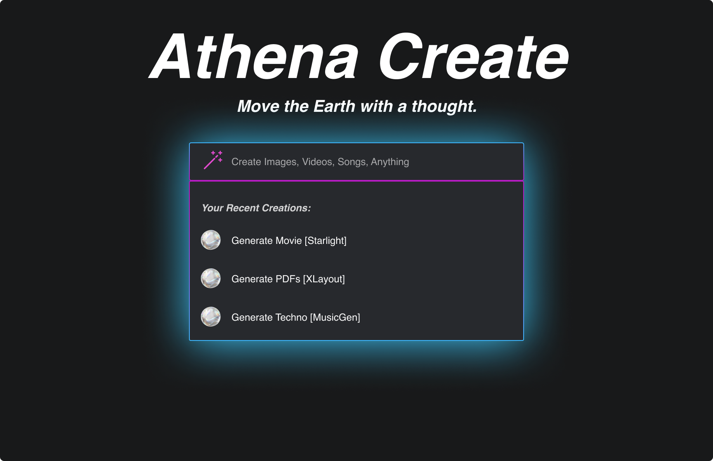

# Athena Create - The Everything App

*Art, science, and the future converge here. This is Athena Create.*

**Welcome to Athena Create, the epicenter of creation and collaboration.** 

## Overview

Athena Create empowers you to bring your ideas to life using state-of-the-art AI models. Whether you're imagining stunning visuals, composing symphonies, or crafting captivating videos, Athena Create serves as your versatile canvas. But it's more than just a tool — it's a thriving community where creators meet, collaborate, and inspire each other.

## Features

**Create**: Unlock your creativity with the power of AI. Generate images, compose music, and design videos — all in one place. 

**Collaborate**: Join a vibrant community of creators. Share your projects, invite feedback, and collaborate with fellow innovators to push the boundaries of what's possible.

**Inspire**: Take part in community challenges, earn badges, and get recognized for your work. Your creations might just be the spark that ignites another's imagination.

## Getting Started

1. Fork and clone the Athena Create repository.
2. Install dependencies with `npm install`.
3. Start the development server with `npm start`.

## How to Contribute

We welcome contributions from anyone and everyone. To get started, take a look at our [Contribution Guidelines](https://github.com/kyegomez/Athena-Create/blob/main/CONTRIBUTING.md).

## Share with Friends and Family

Unleash the power of social media and let your creations reach every corner of the globe. Share your Athena Create projects on:

- [Facebook](https://www.facebook.com/sharer/sharer.php?u=https://github.com/kyegomez/Athena-Create)
- [Twitter](https://twitter.com/intent/tweet?text=Check%20out%20my%20new%20creation%20on%20Athena%20Create!&url=https://github.com/kyegomez/Athena-Create)
- [LinkedIn](https://www.linkedin.com/sharing/share-offsite/?url=https://github.com/kyegomez/Athena-Create)
- [Instagram](instagram://camera)
- [Pinterest](http://pinterest.com/pin/create/button/?url=https://github.com/kyegomez/Athena-Create)
- [WhatsApp](https://wa.me/?text=Check%20out%20my%20new%20creation%20on%20Athena%20Create!%20https://github.com/kyegomez/Athena-Create)
- [Telegram](https://telegram.me/share/url?url=https://github.com/kyegomez/Athena-Create&text=Check%20out%20my%20new%20creation%20on%20Athena%20Create!)

## License

Athena Create is open-source and is licensed under the [CC0 1.0 Universal
 License](https://github.com/kyegomez/Athena-Create/blob/main/LICENSE).

## Final Thoughts

Athena Create is not just an app — it's a vision for a future where anyone can be an artist, where creativity is democratized, and where the boundary between reality and imagination blurs. We invite you to join us on this journey

.

*Turn the ethos of creation into the echo of the cosmos. This is Athena Create.*

# Roadmap:

* Recreate Frontend to not doing anything by it's own

* Recreate backend to communicate with the front end when a query is sent

* Functional prototype

## Feature Ideas:

* File upload, images, pdfs, etc rounded square box

* Create API logic to CRUD multi-modal user data to postgresql + AWS S3

* Share with friends feature

* Ask Follow up

* Ocean Vector-Database to store, embed, and query multi-modal documents

* Gallery/Marketplace, For You page to see what people have created, like share, and buy and sell

* [Backend] Store all user generated data on the backend.

* Auto-Complete from recent Creations.

* 5 Free creations a day, upgrade to 20$ plan for more! 

* Confetti Animation to reward users for creating

* User feedback on all multi-modal answers to run RLHF, new way of liking perhaps owls as ratings?

* Allow users to integrate their own models

* Allow users to see 4 previews of their generated data then perhaps do HLMF

* Become new cosmos.so

* Create new marketplace for AI Models and services, new Huggingface, Allow developers to offer custom AI models which other users can pay to access and we take a fee or we pay the developers based on usage out of the base subscription.  similar to the App Store's model.

* Become new TikTok for Creators

* Implement Monolith' byte dance algorithm with multi-modality

* For you page

* Create, Iterate, Share

* Creation Streaks

* Acquire Replit and integrate it into Athena Create