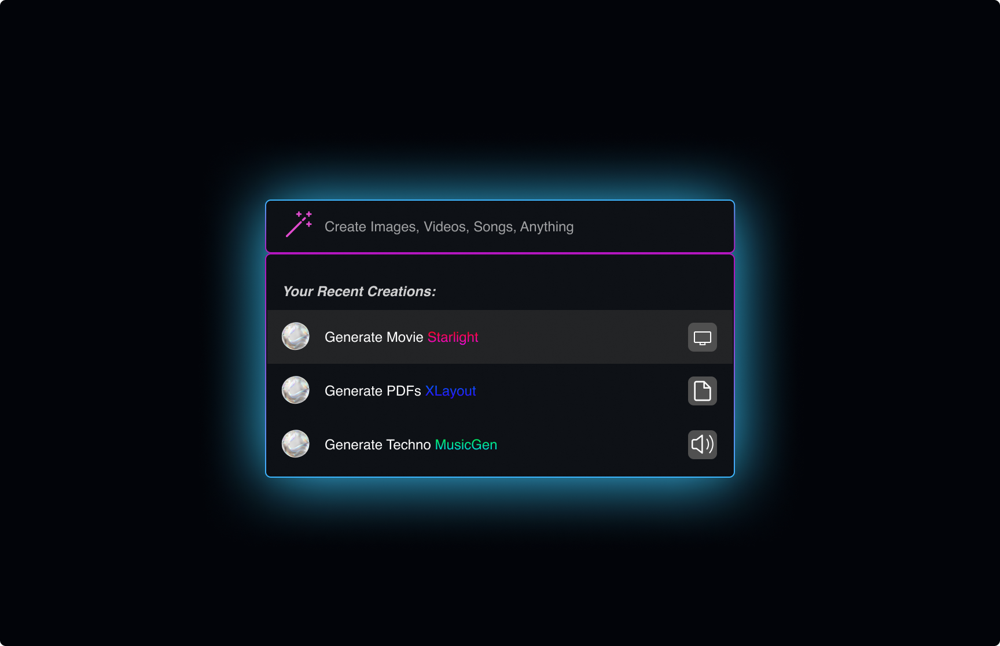

# Agora

Agora is a collective of creators, [join us and help create Athena Create and or receive support!](https://discord.gg/qUtxnK2NMf)

# Athena Create - The Everything App
**Welcome to Athena Create, the epicenter of creation and collaboration.** 



*Art, science, and the future converge here. This is Athena Create.*

## Overview

Athena Create empowers you to bring your ideas to life using state-of-the-art AI models. Whether you're imagining stunning visuals, composing symphonies, or crafting captivating videos, Athena Create serves as your versatile canvas. But it's more than just a tool — it's a thriving community where creators meet, collaborate, and inspire each other.

## Features

**Create**: Unlock your creativity with the power of AI. Generate images, compose music, and design videos — all in one place. 

**Collaborate**: Join a vibrant community of creators. Share your projects, invite feedback, and collaborate with fellow innovators to push the boundaries of what's possible.

**Inspire**: Take part in community challenges, earn badges, and get recognized for your work. Your creations might just be the spark that ignites another's imagination.

## Getting Started
There are 2 methods, 1 local no docker, and docker:

### Method 1
1. Fork and clone the Athena Create repository.
2. Start the backend: 
```bash
# setup env
cd server
conda create -n athena python=3.8
conda activate athena
conda install pytorch torchvision torchaudio pytorch-cuda=11.7 -c pytorch -c nvidia
pip install -r requirements.txt

# download models. Make sure that `git-lfs` is installed.
cd models
bash download.sh # required when `inference_mode` is `local` or `hybrid`. 

# run server
cd ..
python models_server.py --config configs/config.default.yaml # required when `inference_mode` is `local` or `hybrid`
python awesome_chat.py --config configs/config.default.yaml --mode server # for text-davinci-003
```
3. Prepare frontend: `cd frontend` then Install dependencies with `npm install` then start dev server: `npm run dev`

# Method2
Docker, not done yet

## How to Contribute

We welcome contributions from anyone and everyone. To get started, take a look at our [Contribution Guidelines](https://github.com/kyegomez/Athena-Create/blob/main/CONTRIBUTING.md).

## Share with Friends and Family

Unleash the power of social media and let your creations reach every corner of the globe. Share your Athena Create projects on:

- [Facebook](https://www.facebook.com/sharer/sharer.php?u=https://github.com/kyegomez/Athena-Create)
- [Twitter](https://twitter.com/intent/tweet?text=Check%20out%20my%20new%20creation%20on%20Athena%20Create!&url=https://github.com/kyegomez/Athena-Create)
- [LinkedIn](https://www.linkedin.com/sharing/share-offsite/?url=https://github.com/kyegomez/Athena-Create)
- [Instagram](instagram://camera)
- [Pinterest](http://pinterest.com/pin/create/button/?url=https://github.com/kyegomez/Athena-Create)
- [WhatsApp](https://wa.me/?text=Check%20out%20my%20new%20creation%20on%20Athena%20Create!%20https://github.com/kyegomez/Athena-Create)
- [Telegram](https://telegram.me/share/url?url=https://github.com/kyegomez/Athena-Create&text=Check%20out%20my%20new%20creation%20on%20Athena%20Create!)

## License

Shield: [![CC BY-NC-SA 4.0][cc-by-nc-sa-shield]][cc-by-nc-sa]

This work is licensed under a
[Creative Commons Attribution-NonCommercial-ShareAlike 4.0 International License][cc-by-nc-sa].

[![CC BY-NC-SA 4.0][cc-by-nc-sa-image]][cc-by-nc-sa]

[cc-by-nc-sa]: http://creativecommons.org/licenses/by-nc-sa/4.0/
[cc-by-nc-sa-image]: https://licensebuttons.net/l/by-nc-sa/4.0/88x31.png
[cc-by-nc-sa-shield]: https://img.shields.io/badge/License-CC%20BY--NC--SA%204.0-lightgrey.svg

## Final Thoughts

Athena Create is not just an app — it's a vision for a future where anyone can be an artist, where creativity is democratized, and where the boundary between reality and imagination blurs. We invite you to join us on this journey

.

*Turn the ethos of creation into the echo of the cosmos. This is Athena Create.*


# Roadmap

* Brute force to functional prototype that takes in user input, text or multi-modal => sends to swarm => worker node uses model from HF to complete the user task

* Implement Database logic

* Deploy on AWS at `create.apac.ai`

* Optimize for reliability and speed
